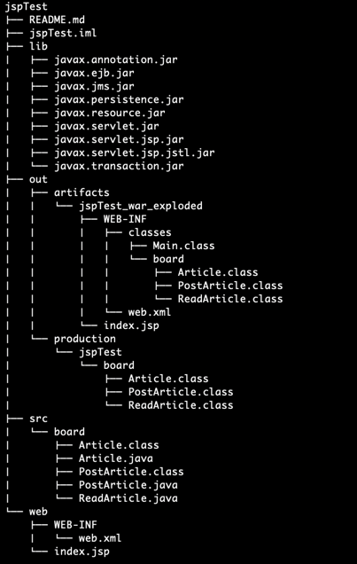

# 들어가기
- tomcat을 사용해서 기본적인 서블릿 게시판 기능 구현

### 환경
- JAVA: openJDK 17.0.9
- IDE: IntelliJ
- Tomct 8.5.61

### 구현 및 배포
#### 구현
- 소스는 프로젝트 하위 src/board 에 Article.java, PostArticle.java 파일을 작성
- tomcat 에서 확인할 web.xml 파일은 web/WEB-INF 하위에 작성
- 디렉토리 tree 구조

#### 배포
- tomcat 홈디렉토리 하위에 디렉토리 생성 후 class 파일을 add
- $TOMCAT_HOME/webapps/board
- 디렉토리 tree 구조

